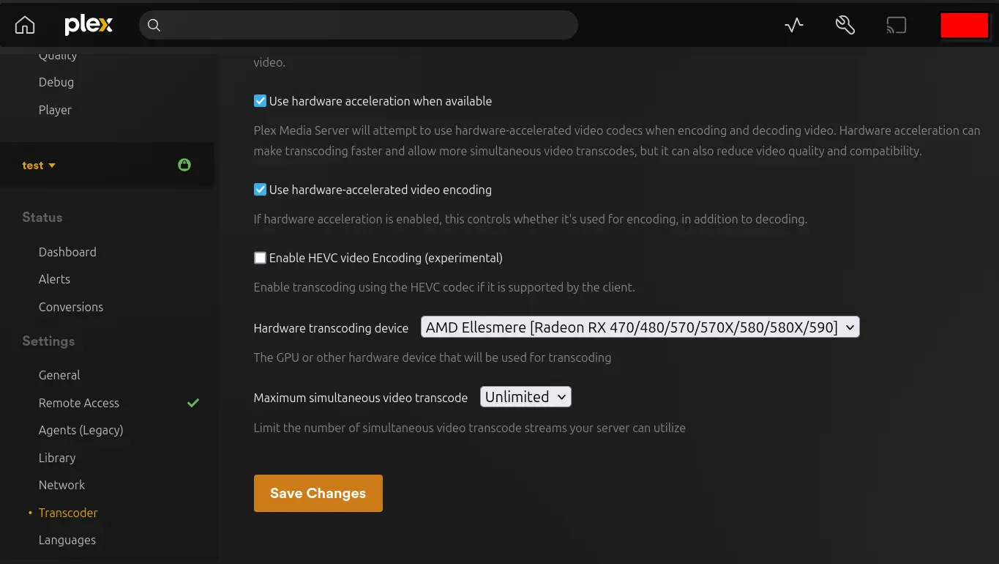

<!--
SPDX-FileCopyrightText: 2020 Aaron Raimist
SPDX-FileCopyrightText: 2020 Chris van Dijk
SPDX-FileCopyrightText: 2020 Dominik Zajac
SPDX-FileCopyrightText: 2020 Mickaël Cornière
SPDX-FileCopyrightText: 2020-2024 MDAD project contributors
SPDX-FileCopyrightText: 2020-2024 Slavi Pantaleev
SPDX-FileCopyrightText: 2022 François Darveau
SPDX-FileCopyrightText: 2022 Julian Foad
SPDX-FileCopyrightText: 2022 Warren Bailey
SPDX-FileCopyrightText: 2023 Antonis Christofides
SPDX-FileCopyrightText: 2023 Felix Stupp
SPDX-FileCopyrightText: 2023 Pierre 'McFly' Marty
SPDX-FileCopyrightText: 2024-2026 Suguru Hirahara

SPDX-License-Identifier: AGPL-3.0-or-later
-->

# Setting up Plex Media Server

This is an [Ansible](https://www.ansible.com/) role which installs a standalone [Plex Media Server](https://docs.linuxserver.io/images/docker-plex) to run as a [Docker](https://www.docker.com/) container wrapped in a systemd service.

Plex is a personal media server that allows you to organize and stream your collection of movies, TV shows, music, and photos.

See the project's [documentation](https://docs.linuxserver.io/images/docker-plex/) to learn what Plex Media Server does and why it might be useful to you.

## Adjusting the playbook configuration

To enable Plex Media Server with this role, add the following configuration to your `vars.yml` file.

**Note**: the path should be something like `inventory/host_vars/mash.example.com/vars.yml` if you use the [MASH Ansible playbook](https://github.com/mother-of-all-self-hosting/mash-playbook).

```yaml
########################################################################
#                                                                      #
# plex                                                                 #
#                                                                      #
########################################################################

plex_enabled: true

########################################################################
#                                                                      #
# /plex                                                                #
#                                                                      #
########################################################################
```

### Set the hostname

To enable Plex Media Server you need to set the hostname as well. To do so, add the following configuration to your `vars.yml` file. Make sure to replace `example.com` with your own value.

```yaml
plex_hostname: "example.com"
```

After adjusting the hostname, make sure to adjust your DNS records to point the domain to your server.

### Mount data directories

To mount a data directory inside the container, add the following configuration to your `vars.yml` file (adapt to your needs):

```yaml
plex_media_bind_path: /media
```

This case, the directory specified with `plex_media_path` on the host machine will be available at `/media` inside the container.

To mount additional data directories, add the following configuration to your `vars.yml` file (adapt to your needs):

```yaml
plex_container_additional_volumes_custom:
  - type: bind
    src: /path/to/blackhole
    dst: /downloads
```

### Exposing ports

By default no ports are exposed, but there are some ports which you'll most likely want to expose. To do so, add the following configuration to your `vars.yml` file (adapt to your needs):

```yaml
# The main Plex webserver port
# Add this setting (and configure port-forwarding in your router) if you want to access Plex Media Server from https://app.plex.tv or via TV and phone apps
plex_container_http_host_bind_port: 32400

# GDM network discovery ports
# Add this setting if you want to let Plex clients on the same network discover your server and connect to it locally, connecting back to your server via its external IP address
plex_container_gdm_bind_port_01: 32410
plex_container_gdm_bind_port_02: 32412
plex_container_gdm_bind_port_03: 32413
plex_container_gdm_bind_port_04: 32414
```

Refer to [`defaults/main.yml`](../defaults/main.yml) for other ports such as the ones used for accessing to the Plex DLNA server or controlling Plex for Roku via Plex Companion.

Refer to the official documentation as well:

- <https://support.plex.tv/articles/201543147-what-network-ports-do-i-need-to-allow-through-my-firewall/>
- <https://docs.linuxserver.io/images/docker-plex/#umask-for-running-applications>

### Specify Plex Claim Token

To use Plex Media Server it is necessary to connect it to your plex.tv user account by "claiming" it. The claim token can be obtained at <https://plex.tv/claim>.

Since the container is configured to run in "host" networking mode, it is required that the claim token be provided during first time setup.

To specify the token, add the following configuration to your `vars.yml` file:

```yaml
plex_claim_token: YOUR_PLEX_CLAIM_TOKEN_HERE
```

>[!NOTE]
> **The claim token expires after 4 minutes.** It is recommended to obtain the token after making sure that you have finished adjustment of the other settings.

### Plex Pass updates

To enable Plex Pass updates you need to run the container as a root user with the writable filesystem:

```yaml
plex_uid: 0
plex_gid: 0

plex_container_read_only: false
```

You'll also want to set `plex_version_environment_variable` to `latest` or `public`.

### Hardware Acceleration

To enable hardware acceleration you'll first need to determine your GPU brand. Once you've done this, read the corresponding section below:

#### Intel/ATI/AMD

For Intel/ATI/AMD GPUs enabling hardware acceleration is as easy as mounting the device into the container:

```yaml
# The path where the Intel/ATI/AMD GPU is on the host system
plex_gpu_path: "/dev/dri"

# The path to mount the Intel/ATI/AMD GPU to in the container.
# Takes a path value (e.g. "/dev/dri"), or empty string to not mount.
plex_gpu_bind_path: "{{ plex_gpu_path }}"
```

Upstream documentation: <https://docs.linuxserver.io/images/docker-plex/#intelatiamd>

#### NVIDIA

For NVIDIA GPUs enabling hardware acceleration is a little bit tricky since it (currently) requires the manual installation of the [NVIDIA container runtime](https://github.com/NVIDIA/nvidia-container-toolkit). Consult your distribution's documentation on installing this.

Once the runtime is installed and available, add the following configuration:

```yaml
# The container runtime that the container engine should use
plex_container_runtime: "nvidia"

# To enable NVIDIA GPU hardware acceleration this value should either be 'all' or the UUID value of the GPU
# which can obtained with the command -> 'nvidia-smi --query-gpu=gpu_name,gpu_uuid --format=csv'
plex_nvidia_visible_devices: "all"
```

Upstream documentation: <https://docs.linuxserver.io/images/docker-plex/#nvidia>

### Extending the configuration

There are some additional things you may wish to configure about the service.

Take a look at:

- [`defaults/main.yml`](../defaults/main.yml) for some variables that you can customize via your `vars.yml` file. You can override settings (even those that don't have dedicated playbook variables) using the `plex_environment_variables_additional_variables` variable

## Installing

After configuring the playbook, run the installation command of your playbook as below:

```sh
ansible-playbook -i inventory/hosts setup.yml --tags=setup-all,start
```

If you use the MASH playbook, the shortcut commands with the [`just` program](https://github.com/mother-of-all-self-hosting/mash-playbook/blob/main/docs/just.md) are also available: `just install-all` or `just setup-all`

## Usage

After running the command for installation, Plex Media Server becomes available at the specified hostname like `https://example.com`.

To get started, open the URL with a web browser, and follow the set up wizard.

When prompted to add your media libraries keep in mind that it will be the path **inside** the container, most likely the `dst` parameter of your `plex_container_additional_volumes_custom` variable.

## Troubleshooting

### Check recognized GPUs on settings

To verify Plex is detecting your GPU device, navigate to `Settings -> Transcoder -> Hardware transcoding device` and select your GPU. If you do not see the `Hardware transcoding device` drop-down make sure you have ticked the `Use hardware acceleration when available` checkbox.

If it is recognized properly, it is listed on the settings as below:



### Check the service's logs

You can find the logs in [systemd-journald](https://www.freedesktop.org/software/systemd/man/systemd-journald.service.html) by logging in to the server with SSH and running `journalctl -fu plex` (or how you/your playbook named the service, e.g. `mash-plex`).
